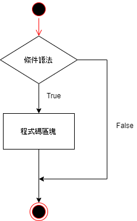

條件控制
====================================

Python 條件語法是通過一條或多條語法的執行結果（``True`` 或者 ``False``）來決定執行的代碼區塊。

可以通過下圖來簡單了解條件語法的執行過程:

if 語法
-----------------------------------------

Python 中 ``if`` 語法的一般形式如下所示：

.. code-block:: python

    if condition_1 :
        statement_block_1 
    elif condition_2 :
        statement_block_2 
    else :
        statement_block_3 

- 如果 ``condition_1`` 為 ``True`` 將執行 ``statement_block_1`` 塊語法
- 如果 ``condition_1`` 為 ``False``，將判斷 ``condition_2``
- 如果 ``condition_2`` 為 ``True`` 將執行 ``statement_block_2`` 塊語法
- 如果 ``condition_2`` 為 ``False``，將執行 ``statement_block_3`` 塊語法

Python 中用 ``elif`` 代替了 ``else if``，所以 ``if`` 語句的關鍵字為：``if – elif – else``

注意：

1. 每個條件後面要使用冒號 ``:``，表示接下來是滿足條件後要執行的語法塊
2. 使用縮進來劃分語法塊，相同縮進數的語法在一起組成一個語法塊
3. 在 Python 中沒有 ``switch – case`` 語法

以下是一個簡單的 ``if`` 範例：

.. code-block:: python

    var1 = 100 
    if var1 == 100 :
        print(var1)
    elif var1 == 10:
        print(var1)
    else:
        print(False)

    var1 = 10
    if var1 == 100:
        print(var1)
    elif var1 == 10:
        print(var1)
    else:
        print(False)
        
    var1 = 0
    if var1 == 100:
        print(var1)
    elif var1 == 10:
        print(var1)
    else:
        print("False")

以上範例程式輸出結果如下：

.. code-block:: console

    100
    10
    False

以下為 if 語法中常用的操作運算符：

- ``<``：小於
- ``<=``：小於或等於
- ``>``：大於
- ``>=``：大於或等於
- ``==``：等於，比較兩個值是否相等
- ``!=``：不等於

以下為應用操作運算符的範例：

.. code-block:: python

    x = int(input("Enter x number: "))
    y = int(input("Enter y number: ")) 

    if x == y:
        print(str(x) + " == " + str(y))
    elif x < y:
        print(str(x) + " < " + str(y))
    elif x > y:
        print(str(x) + " > " + str(y))
    else:
        print("False")

以上範例程式輸出結果如下：

.. code-block:: console

    Enter x number: 10
    Enter y number: 5
    10 > 5

巢狀 if
-----------------------------------------

在巢狀 ``if`` 語法中，可以把 ``if...elif...else`` 結構放在另外一個 ``if...elif...else`` 結構中。

以下為應用操作運算符的範例：

.. code-block:: python

    num = int(input("輸入一個數字：")) 

    if num % 2 == 0 :
        if num % 3 == 0 :
            print("你輸入的數字可以整除 2 和 3")
        else :
            print("你輸入的數字可以整除 2，但不能整除 3") 
    else :
        if num % 3 == 0 :
            print("你輸入的數字可以整除 3，但不能整除 2") 
        else :
            print("你輸入的數字不能整除 2 和 3")

以上範例程式輸出結果如下：

.. code-block:: console

    輸入一個數字：6
    你輸入的數字可以整除 2 和 3
