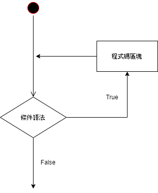
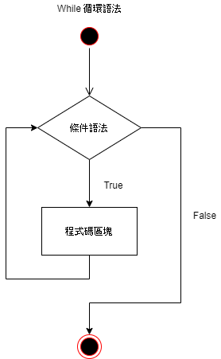
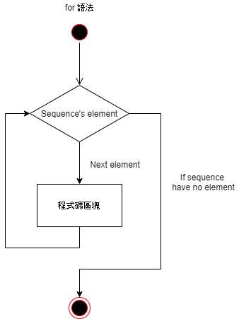
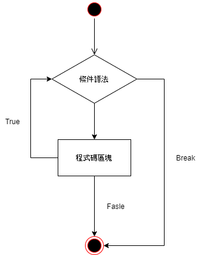
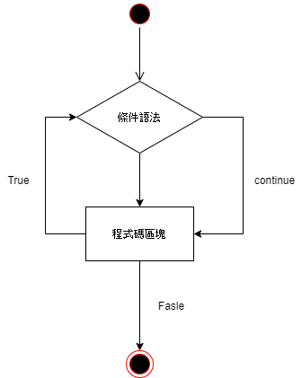

循環語法
====================================

Python 中的循環語法有 ``for`` 和 ``while``，控制結構圖如下所示：

while 循環語法
-----------------------------------------

Python 中 ``while`` 語法的一般形式如下：

.. code-block:: python

    while 判斷條件(condition):
        執行語句(statements)

執行流程圖如下：

以下實例使用了 ``while`` 來計算 1 到 100 的總和：

.. code-block:: python

    n = 100 
    answer = 0 
    counter = 1 

    while counter <= n :
        answer = answer + counter 
        counter += 1 
        
    print("1 到 %d 之和為: %d" % (n, answer))

以上範例程式輸出結果如下：

.. code-block:: console

    1 到 100 之和為: 5050

- 在 ``while`` 語法中同樣需要注意冒號和縮排。另外在 Python 中沒有 ``do..while`` 循環

**無限循環**

我們可以通過設置條件表達式永遠不為 ``false`` 來實現無限循環，實例如下：

.. code-block:: python

    var = True
    while var == True :   #表達式永遠為true 
        num = int(input("輸入一個數字: ")) 
        print("你輸入的數字是:", num)

當遇到無限循環可以使用 ``CTRL+C`` 來退出當前的無限循環，根據情況不同必須特別注意無限循環的狀況

**簡單語句組**

若 ``while`` 循環中只有一條程式碼，你可以將該程式碼與 ``while`` 寫在同一行中，如以下程式範例：

.. code-block:: python

    flag = True
    while flag: print ('Welcome!')

以上範例程式輸出結果如下：

.. code-block:: console

    Welcome!
    Welcome!
    Welcome!
    .
    .
    .

while...else 循環語法
-----------------------------------------

在 ``while...else`` 在條件語句為 ``false`` 時執行 ``else`` 的語句塊。

語法格式如下：

.. code-block:: python

    while 條件語法:
        程式碼區塊 1
    else:
        程式碼區塊 2

以下實例使用了 ``while...else`` 來循環輸出數字，並判斷大小：

.. code-block:: python

    count = 0
    while count < 5:
        print(count, "大於 5")
        count = count + 1
    else:
        print(count, "大於或等於 5")

以上範例程式輸出結果如下：

.. code-block:: console

    0 大於 5
    1 大於 5
    2 大於 5
    3 大於 5
    4 大於 5
    5 大於或等於 5

for 語法
-----------------------------------------

Python ``for`` 語法可以遍歷任何序列的項目，如一個串列或者一個字串。

``for`` 循環的一般格式如下：

.. code-block:: console

    for 變數 in 序列:
        程式碼區塊
    else:
        程式碼區塊

執行流程圖如下：

以一個簡單的例子實作 for 語法：

.. code-block:: python

    languages = ["C", "C++", "Perl", "Python"] 
    for x in languages:
        print (x)

以上範例程式輸出結果如下：

.. code-block:: console

    C
    C++
    Perl
    Python

range()函數
-----------------------------------------

如果需要遍歷數字序列，可以使用 Python 內建的 ``range()`` 函數。它會生成數列，例如：

. code-block:: python

    for i in range(5):
        print(i)

以上範例程式輸出結果如下：

.. code-block:: console

    0
    1
    2
    3
    4

也可以使用 ``range()`` 指定區間的值，產生由起始直到 ``結束值-1`` 的數列

. code-block:: python

    for i in range(5,9) :
        print(i)

以上範例程式輸出結果如下：

.. code-block:: console

    5
    6
    7
    8

``range()`` 還能指定不同的步長來產生數列

. code-block:: python

    for i in range(0, 10, 3) :
        print(i)

以上範例程式輸出結果如下：

.. code-block:: console

    0
    3
    6
    9

len() 與 range() 函數
-----------------------------------------

在 Python 中常以 ``range()`` 和 ``len()`` 函數的結合來遍歷一個序列的元素：

如以下程式範例：

.. code-block:: python
    
    a = ['Google', 'Baidu', 'Runoob', 'Taobao', 'QQ']
    for i in range(len(a)):
        print(i, a[i]) 

以上的輸出結果如下：

.. code-block:: console

    0 Google
    1 Baidu
    2 Runoob
    3 Taobao
    4 QQ

break
-----------------------------------------

``break`` 語法可以跳出 ``for`` 和 ``while`` 的循環體。如果從 ``for`` 或 ``while`` 循環中終止，任何對應的循環 ``else`` 將不執行

流程圖如下：

以下為 ``while`` 與 ``break`` 的範例程式：

.. code-block:: python
    
    n = 5
    while n > 0:
        n -= 1
        if n == 2:
            break
        print(n)
    print('Exit') 

以上的輸出結果如下：

.. code-block:: console

    4
    3
    Exit

以下為 ``for`` 與 ``break`` 的範例程式：

.. code-block:: python
    
    for i in range(0, 5):
        if i == 3:
            break
        print(i)
    print('Exit')

以上的輸出結果如下：

.. code-block:: console

    0
    1
    2
    Exit

continue
-----------------------------------------

``continue`` 語法被用來告訴 Python 跳過當前循環塊中的剩餘程式碼，然後繼續進行下一輪循環。

流程圖如下：

以下為 ``while`` 與 ``break`` 的範例程式：

.. code-block:: python
    
    n = 5
    while n > 0:
        n -= 1
        if n == 2:
            continue
        print(n)
    print('Exit')  

以上的輸出結果如下：

.. code-block:: console

    4
    3
    1
    0
    Exit

以下為 ``for`` 與 ``break`` 的範例程式：

.. code-block:: python
    
    for i in range(0, 5):
        if i == 3:
            continue
        print(i)
    print('Exit')

以上的輸出結果如下：

.. code-block:: console

    0
    1
    2
    4
    Exit

pass
-----------------------------------------

Python 中 ``pass`` 是空語法，是為了保持程序結構的完整性。

``pass`` 不做任何事情，一般用做佔位語法，如以下程式範例：

.. code-block:: python
    
    for letter in 'Google': 
        if letter == 'o':
            pass
            print ('pass')
        print ('Char :', letter)

以上的輸出結果如下：

.. code-block:: console

    Char : G
    pass
    Char : o
    pass
    Char : o
    Char : g
    Char : l
    Char : e